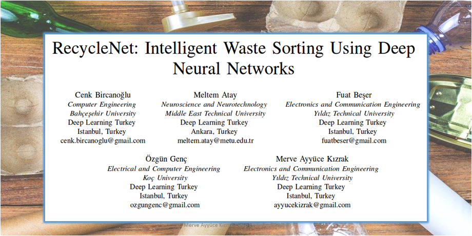

## Geri Dönüşüm Malzemelerinin Derin Öğrenme Yöntemleri ile Tanınması
Bu çalışma Deep Learning Türkiye Topluluğu Uluslarası Akademik Çalışmasıdır.

### Makalenin Türkçe sunumu DeepCon'18 Yapay Zeka Konferansında atölye çalışmasında gerçekleştirilmiştir.

Makalenin tamamını incelemek isterseniz: [RecycleNet: Intelligent Waste Sorting Using Deep Neural Networks](https://ieeexplore.ieee.org/document/8466276)

## Veri Kümesi
Veri kümesinde aşağıda içerik sayıları da verilen 6 sınıftan oluşmaktadır: 
* 501 cam
* 594 kağır
* 403 karton
* 482 plastik
* 410 metal
* 137 çöp
Toplanda 2527 görüntü içermektedir.

Görüntüler gün ışığı ve oda aydınlatmasında çekilmiştir ve boyutları 512 x 384 olarak eşitlenmiştir. Fotoğraflar Apple iPhone 7 Plus, Apple iPhone 5S ve Apple iPhone SE akıllı telefonları kullanılarak çekilmiştir.

Veri kümesini [buradan](https://drive.google.com/drive/folders/0B3P9oO5A3RvSUW9qTG11Ul83TEE) indirebilirsiniz!

> RecycleNet kaynak kodları yakında bu repoya eklenecektir!

