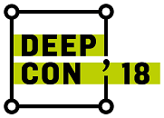
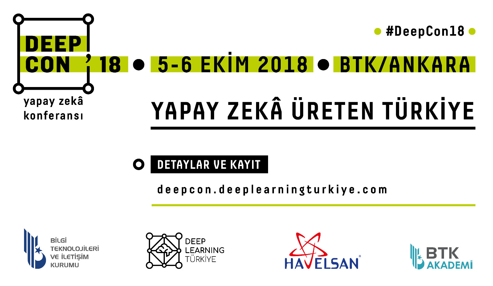

# [DeepCon'18 Yapay Zeka Konferansı](http://deepcon.deeplearningturkiye.com/) 

## Yapay Zeka Üreten Türkiye!

5-6 Ekim tarihlerinde [**Deep Learning Türkiye (DLTR)**](http://deeplearningturkiye.com/), [**Bilgi Teknolojileri ve İletişim Kurumu (BTK)**](https://www.btk.gov.tr/) ve [**HAVELSAN**](http://www.havelsan.com.tr/) iş birliğinde bu yıl ilki düzenlenen [**Yapay Zeka Konferansı (DeepCon'18)**](http://deepcon.deeplearningturkiye.com/) ile bu alanda çalışmakta olan akademi, özel sektör ve kamu aktörlerinin bir araya getirilerek, yenilikçi ve ilgi çekici fikirlerin ortaya koyulması sağlandı. Bilgi Teknolojileri ve İletişim Kurumu’nun ev sahipliği yaptığı DeepCon’18 etkinliğinin ilk gününde, alanında uzman isimlerin panel oturumlarına ve sunumlarına, ikinci gününde ise uygulamalı atölye çalışmalarına yer verildi. Ülkemizde yapay zeka ve derin öğrenme alanında farkındalık yaratmak amacıyla bir araya gelen Deep Learning Türkiye topluluğunun da katkılarıyla gerçekleştirilen etkinlikte, finanstan savunmaya, sağlıktan bankacılığa kadar farklı pek çok sektörde yapay zekanın son teknolojideki gelişmeleri detaylıca incelendi ve tartışıldı.

⭐️Bu repoda **DeepCon'18** dokumanlarına ulaşabiirsiniz.⭐️

## Konuşmacı Sunumları :heavy_check_mark:
1. [Yapay Görsel Zekaya Doğru](https://github.com/deeplearningturkiye/DeepCon18/blob/master/Konusmac-_Sunumlari/1-DeepCon_AykutErdem.pdf) - Dr. Aykut Erdem
2. [Microsoft'un Yapay Zeka ile Türkiye'ye Etkisi](https://github.com/deeplearningturkiye/DeepCon18/blob/master/Konusmac-_Sunumlari/2-DeepCon_Onur%20Koc.pdf) - Onur Koç
3. [Yapay Zekanın Hukuk Alanındaki Yansımaları](https://github.com/deeplearningturkiye/DeepCon18/blob/master/Konusmac-_Sunumlari/3-DeepCon_Av.SertalSiraci.pdf) - Av. Sertel Şıracı
4. [Otonom Araç Tasarımında Yapay Zeka](https://github.com/deeplearningturkiye/DeepCon18/blob/master/Konusmac-_Sunumlari/4-DeepCon_AliOsmanOrs.pdf) - Ali Osman Ors
5. [Türkiye’nin Yapay Zeka Stratejisi Ne Olmalı?](https://github.com/deeplearningturkiye/DeepCon18/blob/master/Konusmac-_Sunumlari/5-DeepCon_ESerdarGokpinar.pdf) - Dr. E. Serdar Gökpınar
6. [Siber Güvenlik ve Derin Öğrenme Uygulamaları](https://github.com/deeplearningturkiye/DeepCon18/blob/master/Konusmac-_Sunumlari/6-DeepCon_BerkSunar.pdf) - Dr. Berk Sunar
7. [Türkiye'de Endüstri 4.0 Evrimi](https://github.com/deeplearningturkiye/DeepCon18/blob/master/Konusmac-_Sunumlari/7-DeepCon_AlperGer%C3%A7ek.pdf) - Alper Gerçek
8. [Algoritmik Finans]() -  Selim Temizer
9. [Yapay Görme ve Derin Öğrenme Yöntemlerinin Perakende Sektörüne Uygulanması](https://github.com/deeplearningturkiye/DeepCon18/blob/master/Konusmac-_Sunumlari/9-DeepCon_ErdemYoruk.pdf) - Erdem Yörük

## Konuşmacı Videoları :tv:
:hourglass_flowing_sand: Çok yakında [**Deep Learning Türkiye YouTube**](https://www.youtube.com/channel/UCrp_7_JACqsYbSmHFowvqbg) kanalında olacak!

## Atölye Sunumları :heavy_check_mark:
1. Tensorflow.js ile Derin öğrenme web uygulaması geliştirme - Yavuz Kömeçoğlu  (Kodiks Bilişim / DLTR) 
2. Eğitimde Yapay Zeka - Dr. Sevinç Tunalı (TASAM)
3. Derin Pekiştirmeli Öğrenmede Çok Kollu Haydutlar problemi - DLTR Çalışma Grubu 
4. Derin Öğrenme Yöntemleri (LSTM/RNN) Kullanarak Alışveriş Robotu Geliştirme - Buğra Çakır (BearTell / CEO)
5. Çekişmeli Üretici Ağları (GAN) Kullanarak Sentetik Veri Üretimi - Şahin Olut (İTÜ / VisionLab)
6. Kamera ve LiDAR verileri kullanılarak NVIDIA Drive Platformunda Otomotiv Uygulamaları - Fatih Cırıt (Leo Mühendislik)
7. Geri Dönüşüm Malzemelerinin Tanınması -  Merve Ayyüce Kızrak (Haliç Üniversitesi / DLTR)
8. E-Ticaret ve Yapay Zeka Uygulamaları - Cüneyt Aksakallı (SefaMerve / DLTR)
9. OpenAI Gym ile Pekiştirmeli Öğrenme - Umut Can Altın (Eskişehir Anadolu Üniv. / DLTR)
10. Biyomedikal İşaretler Kullanılarak Yapay Zeka ile Hastalık Teşhisi - Sebahattin Babur (İstanbul Gedik Üniv.)
11. Sıfırdan Derin Öğrenme Çerçevesi Oluşturma (iki oturum) - Erelcan Yanık (Havelsan)
12. LSTM ve CNN ile Görsel Soru Cevaplama - Başak Buluz (Aydın Üniversitesi / DLTR)
13. Derin Öğrenme ile Renormalizasyon Grupları Arası Haritalama - Göktuğ İslamoğlu (İTÜ / İnşaat Müh.)
14. Bulut Teknolojileri Kullanarak Makine Öğrenmesi Modellerinin Oluşturulması - Barış Yaşin (AWS / Solution Architect)
15. Kelime Kalıplama (Word Embeddings) Yöntemler - Halil İbrahim Çelenli (Iceberg Tech. / DLTR)
16. İnsansız Hava Araçları ve Bilgisayarlı Görü - Mehmet Kerim Yücel (STM)
17. Giyim Tarzı Belirleme - Barış Yılmaz (Bilkent / Matematik)
18. Medikal Görüntülerde Landmark Tayini - Ahmet Emin Yetkin (Yeditepe Üniversitesi / DLTR)
19. Yapay Zeka Araçlarını Kullanarak İşitme Engelli Öğrencilere İngilizce Öğretimi - Dr. Burak Özkösem (Pera Labs)
20. Derin Öğrenme ile Doğal Dil İşleme - Fatih Mehmet Güler (PragmaCraft / DLTR)
21. Derin Pekiştirmeli Öğrenmeye Giriş: Doom Oynayan Ajan Geliştirme - Furkan Arslan (Özyeğin Üniversitesi / DLTR)
22.Mamografi Görüntüleri Kullanarak Meme Kanseri Teşhisinin Performans Değerlendirmesi - Burcu Bektaş (İstanbul Üniversitesi-Cerrahpaşa / DLTR)

## Atölye Videoları :tv:
:hourglass_flowing_sand: Çok yakında [**Deep Learning Türkiye YouTube**](https://www.youtube.com/channel/UCrp_7_JACqsYbSmHFowvqbg) kanalında olacak!

